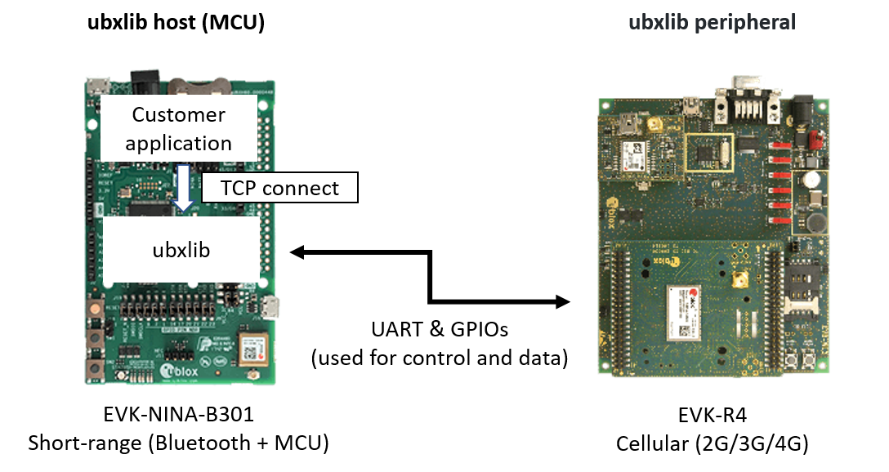
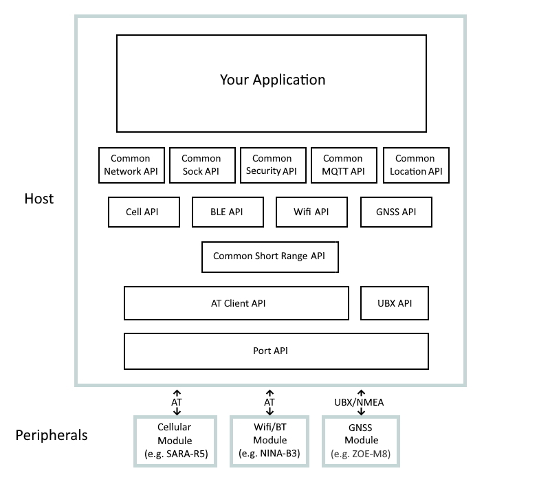

IMPORTANT IMPORTANT IMPORTANT: at the end of January we will make changes to the platform directory structure, bringing the SDK up to the top level. A preview of what this might look like can be seen in the `preview_platform_restructure_do_not_use` branch.


# Introduction to ubxlib
This repository contains the C code support library for [u-blox](https://www.u-blox.com) modules with [Cellular](https://www.u-blox.com/en/cellular-modules) (2G/3G/4G), [Short-Range](https://www.u-blox.com/en/short-range-radio-chips-and-modules) (Bluetooth and WiFi) and [Positioning](https://www.u-blox.com/en/positioning-chips-and-modules) (GNSS) support. The library presents high level C APIs for use in customer applications (e.g. connect to a network, open a TCP socket, establish location, etc.) and implements these APIs on selected popular MCUs, also available inside u-blox modules.

The goal of ubxlib is to deliver a single tested solution with examples which provides uniform easy-to-use APIs across several u-blox products. Releases of ubxlib are tested automatically for all configurations on multiple boards in a [test farm](port/platform/common/automation/DATABASE.md).

The easiest way to quickly explore ubxlib is to acquire u-blox EVKs (Evaluation kits) or application boards containing u-blox modules, one with the role of ubxlib host and one with the role of ubxlib peripherial. Connect them together, configure the library code to reflect the way they are connected together and away you go.

u-blox EVKs or application boards can be found [here](https://www.u-blox.com/en/evk-search) or at major electronic distributors.

Example configuration (many other combinations can be achieved, see table with ubxlib hosts and peripherials below) with EVK-NINA-B301 (Bluetooth 5.0) and EVK-R4 (SARA-R4 with 2G/3G/4G), ubxlib host sets up a TCP connection:



# APIs

The key APIs provided by this repo, and their relationships with each other, are shown in the picture below.



- If you wish to bring up a network and don't care about the details, use the common [network](common/network) API, which can bring up cellular, BLE or Wifi network(s) at your choosing.
- If you wish to use a socket over that network, use the common [sock](common/sock) API.
- If you wish to use u-blox security, use the common [security](common/security) API.
- If you wish to take finer control of your [cellular](cell), [ble](ble) or Wifi connection, use the respective control API directly.
- GNSS is used via the gnss API.
- The BLE and Wifi APIs are internally common within u-blox and so they both use the common [short_range](common/short_range) API.
- The [at_client](common/at_client) API is used by the cellular and short range APIs to talk to AT-based u-blox modules.
- The ubx API implements the necessary encoding/decoding to talk to u-blox GNSS modules.
- The [port](port) API permits all of the above to run on different hosts.

# Which APIs Are Supported On Which u-blox Modules?

|           |             | ubxlib hosts ||||
|-----------|:-----------:|--------------|-----|-----|-----|
|                         |              |C030 board|NINA-W10|NINA-B40 series<br />NINA-B30 series<br />NINA-B1 series<br />ANNA-B1 series<br />|NORA-B10 series|
|                         |              |**MCU**||||
|                         |              |ST-Micro STM32|Espressif ESP32|Nordic nRF52|Nordic nRF53|
|                         |              |**Toolchain**||||
|                         |              |Cube|ESP-IDF|GCC<br />Segger ES (nRF5)|nRF Connect<br />for desktop|
|                         |              |**RTOS / SDK**||||
|                         |              |FreeRTOS|FreeRTOS|FreeRTOS|Zephyr|
| **ubxlib peripherals**   |**API**       |||||
| SARA-U2 series<br />SARA-R41x series<br />| [cell](cell "cell API")<br />[network](common/network "network API")<br />[sock](common/sock "sock API")<br />|Yes|Yes|Yes|Yes|
| SARA-R500S<br />SARA-R510S<br />SARA-R510M8S| [cell](cell "cell API")<br />[network](common/network "network API")<br />[sock](common/sock "sock API")<br />[security](common/security "security API")|Yes|Yes|Yes|Yes|
| SARA-R510M8S            | gnss|TBD|TBD|TBD|TBD|
|NINA-B41 series<br />NINA-B31 series<br />NINA-B1 series<br />ANNA-B1|[ble](ble "ble API")<br />[network](common/network "network API")|Yes|Yes|N/A|N/A|
|NINA-W13|wifi<br />[network](common/network "network API")<br />[sock](common/sock "sock API")|Q1 2021|N/A|Q1 2021|Q1 2021|
|NINA-W15|wifi<br />[ble](ble "ble API")<br />[network](common/network "network API")<br />[sock](common/sock "sock API")|Q1 2021|N/A|N/A|N/A|
|M8 series|gnss|TBD|TBD|TBD|TBD|

# What Is Included
The APIs for each type of u-blox module can be found in the relevant directory (e.g `cell` for cellular modules and `ble`/`wifi` for BLE/Wifi modules).  The `common` directory contains APIs and 'helper' modules that are shared by u-blox modules, most importantly the network API and the sockets API.  All APIs are documented in the API header files.

Examples demonstrating the use of the APIs can be found in the `example` directory.

Each API includes a `test` sub-directory containing the tests for that API which you may compile and run if you wish.

Build information for each platform can be found in the `platform` sub-directory of `port`; more on this below.

In order for u-blox to support multiple platforms with this code there is also a `port` API.  This is not intended to be a generic porting API, it is simply sufficient to support the APIs we require.  If you have not chosen a supported platform you may still be able to use the high level APIs here unchanged by implementing the `port` API for your platform.

```
+---example                    <-- examples that introduce the main features 
+---cfg                        <-- global configuration header files
+---common                     <-- APIs that are common across u-blox modules
¦   +---network                <-- the simple network API for BLE, cell and Wifi
¦   ¦   +---api                <-- all folders, in general, have an API directory
¦   ¦   +---src                    containing public headers, a source directory with
¦   ¦   +---test                   the implementation and a test directory with the tests
¦   +---sock                   <-- the sockets API for cell, Wifi (and in the future BLE)
¦   +---security               <-- common API for u-blox security
¦   +---short_range            <-- internal API used by the BLE and Wifi APIs (see below)
¦   +---at_client              <-- internal API used by the BLE, cell and Wifi APIs
¦   +---error                  <-- u_error_common.h: error codes common across APIs
¦   ...
+---cell                       <-- API for cellular (if you need more than network provides)
+---wifi                       <-- API for Wifi (if you need more than network provides)
+---ble                        <-- API for BLE
+---port                       <-- port API: maps to MCU platforms, includes build metadata
    +---api
    +---test
    +---clib
    +---platform               <-- look here for the supported MCU platforms
        +---<vendor> e.g. espressif
        ¦   +---<chipset> e.g. esp32
        ¦       +---app        <-- main() for this platform: runs all examples and tests
        ¦       +---cfg        <-- platform specific config (pins, OS things, chip HW blocks)
        ¦       +---src        <-- implementation of the port API for this platform
        ¦       +---sdk        <-- the supported SDKs for this platform
        ¦           ...
        ¦           +---runner <-- a build which compiles and links all examples and tests
        +---lint               <-- Lint checking, used by the test automation
        +---common             <-- things common to all platforms, most notably...
            +---automation     <-- the internal Python automation scripts that test everything
            ...
```

# How To Use This Repo
The native SDKs for each supported platform are used directly, unchanged, by this code.  To use this repo you must first choose your platform and the SDK for that platform.  For instance, you might choose the STM32F4 platform, which employs ST's STM32Cube IDE.  Instructions for how to install and use each SDK can be found in the `port/platform/<vendor>/<chipset>/<sdk>` directory; for the STM32F4 platform this would be `port/platform/stm/stm32f4/cube`.

Having chosen your platform and installed the tool chain, navigate to the directory below that to find the required build information.  For instance, you may find a `runner` directory, which is a generic build that compiles any or all of the examples and tests that can run on a given platform.  In that directory you will find detailed information on how to perform the build.

Configuration information for the examples and the tests can be found in the `cfg` directory of your chosen platform.  Depending on how you have connected your MCU to a u-blox module you may need to override this configuration, e.g. to change which MCU pin is connected to which pin of the u-blox module.  The `README.md` for your chosen SDK will tell you how to override conditional compilation flags in order to do this.

# Examples How To Use ubxlib

|  Technology  | Example | Availability |
|--------------|----------|--------------|
| Cellular/Wifi | The [socket](example/sockets "socket Example") example brings up a TCP/UDP socket by using the [network](common/network "network API") and [sock](common/sock "sock API") APIs.  | Q4 2020 / Q1 2021 |
| Cellular     | End-to-end security | Q1 2021|
| Cellular     | CellLocate | Q2 2021|
| Bluetooth    | SPS (serial port service) | Q1 2021|
| WiFi         | tbd | Q1 2021|
| GNSS         | tbd |TBD|

# License
The software in this repository is Apache 2.0 licensed and copyright u-blox with the following exceptions:

- The heap management code (`heap_useNewlib.c`), required because some of the platforms that use newlib and FreeRTOS don't provide the necessary memory management for them to play together, is copyright Dave Nadler.
- The AT client code in `common/at_client` is derived from the Apache 2.0 licensed AT parser of mbed-os.
- The `stm32f4` platform directory necessarily includes porting files from the STM32F4 SDK that are copyright ST Microelectronics.
- The `go` UDP echo server at `common/sock/test/echo_server/echo-server-udp.go` is based on that of AWS FreeRTOS.

In all cases copyright, and our thanks, remain with the original authors.
