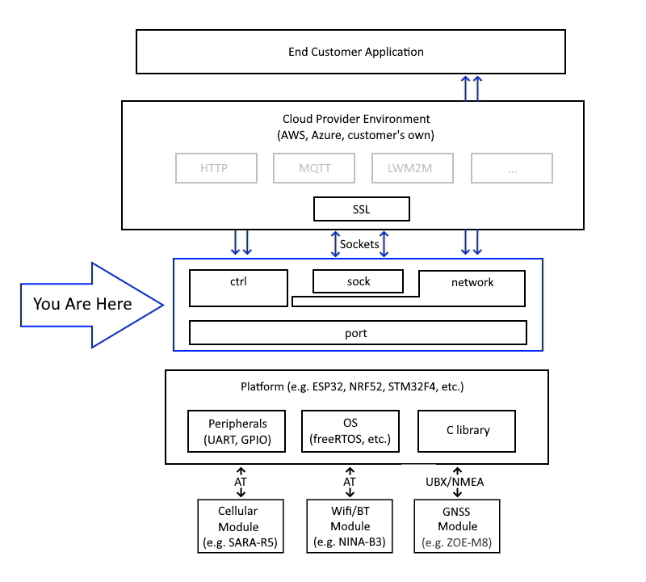

# Introduction
This repository contains the C code support library for u-blox modules.  The library presents a high level C API for use in a customer application (e.g. connect to a network, open a TCP socket, establish location, etc.) and implements that API on selected popular MCUs many of which are also available inside a u-blox module.  Connect these u-blox modules together, or connect a u-blox module to one of those MCUs, configure the library code to reflect how the two are connected and away you go.

# What Is Included
The APIs for each type of u-blox module can be found in the relevant directory (e.g `cell` for cellular modules and `BLE`/`wifi` for BLE/Wifi modules).  The `common` directory contains APIs and 'helper' modules that are shared by u-blox modules, most importantly the network API and the sockets API.  All APIs are documented in the API header files.

Examples demonstrating the use of the APIs can be found in the `example` directory.

Each API includes a `test` sub-directory containing the tests for that API which you may compile and run if you wish.

Build information for each platform can be found in the `platform` sub-directory of `port`; more on this below.

In order for u-blox to support multiple platforms with this code there is also a `port` API.  This is not intended to be a generic porting API, it is simply sufficient to support the APIs we require.  If you have not chosen a supported platform you may still be able to use the high level APIs here unchanged by implementing the `port` API for your platform.

# How To Use This Repo
The native SDKs for each supported platform are used directly, unchanged, by this code.  To use this repo you must first choose your platform and the SDK for that platform.  For instance, you might choose the STM32F4 platform, which employs ST's STM32Cube IDE.  Instructions for how to install and use each SDK can be found in the `port/platform/<vendor>/<chipset>/<sdk>` directory; for the STM32F4 platform this would be `port/platform/stm/stm32f4/cube`.

Having chosen your platform and installed the tool chain, navigate to the directory below that to find the required build information.  For instance, you may find a `runner` directory, which is a generic build that compiles any or all of the examples and tests that can run on a given platform.  In that directory you will find detailed information on how to perform the build.

Configuration information for the examples and the tests can be found in the `cfg` directory of your chosen platform.  Depending on how you have connected your MCU to a u-blox module you may need to override this configuration, e.g. to change which MCU pin is connected to which pin of the u-blox module.  The `README.md` for your chosen SDK will tell you how to override conditional compilation flags in order to do this.

# License
The software in this repository is Apache 2.0 licensed and copyright u-blox with the following exceptions:

- The heap management code (`heap_useNewlib.c`), required because some of the platforms that use newlib and FreeRTOS don't provide the necessary memory management for them to play together, is copyright Dave Nadler.
- The AT client code in `common/at_client` is derived from the Apache 2.0 licensed AT parser of mbed-os.
- The `stm32f4` platform directory necessarily includes porting files from the STM32F4 SDK that are copyright ST Microelectronics.

In all cases copyright, and our thanks, remain with the original authors.