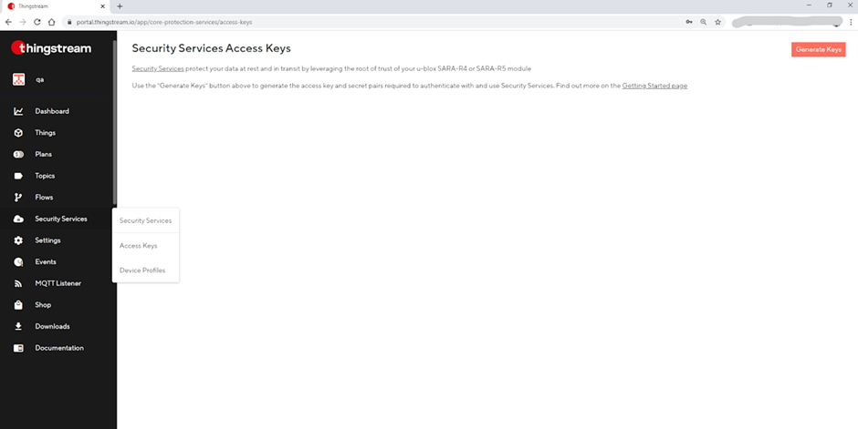

# Contents
* [u-blox IoT Security-as-a-Service Introduction](#u-blox-iot-security-as-a-service-introduction)
* [Evaluation And Starter Kits](#evaluation-and-starter-kits)
* [Device-side](#device-side)
  * [Building](#building)
  * [Using A Cellular Module](#using-a-cellular-module)
* [Broker-side](#broker-side)
  * [Sign-up](#sign-up)
  * [Generate The Access Keys](#generate-the-access-keys)
  * [Create A Device Profile](#create-a-device-profile)
  *	[Using Features And Services](#using-features-and-services)

# u-blox IoT Security-as-a-Service Introduction
IoT Security-as-a-Service is a managed services solution that makes it extremely simple to protect your data at rest and from silicon to cloud, ensuring that you can focus more on your business and enjoy faster time-to-market.

We implement a true end-to-end concept where data are protected from the device to the end user and are not visible at the intermediate nodes/platforms nor by the service provider.  Our approach ensures minimal code development and investment and provides the highest standards of security, leveraging the root of trust in u-blox SARA-R4, SARA-R5 and LARA-R6 module platforms to bring a unique and immutable identity for univocal identification and on-boarding in leading IoT cloud platforms.

The innovative symmetric Key Management System delivers an unprecedented level of security, giving the possibility to generate an infinite number of crypto keys on-the-fly, to be used for (D)TLS or for any other purpose.

All u-blox security solutions are designed for LPWA constrained devices, reducing the data usage and the number of handshakes, thus minimizing the power consumption that is a critical metric for most IoT devices.

You can find more information about IoT Security-as-a-Service [here](https://www.u-blox.com/en/iot-security-service).

# Evaluation And Starter Kits
IoT Security-as-a-Service is available on SARA-R4, SARA-R5 and LARA-R6 series modules, though note that `ubxlib` currently only supports security on SARA-R5.  Several evaluation kits are available:

* EVK-R500S - evaluation kit for SARA-R500S
* EVK-R510S - evaluation kit for SARA-R510S
* EVK-R510M8S - evaluation kit for SARA-R510M8S
* EVK-R422M8S - evaluation kit for SARA-R422M8S
* EVK-R410-8-00 - evaluation kit including LTE module for multi-regional use; Cat M1, NB1 bands: 3, 5, 8, 20, 28
* EVK-R410-7-00 - evaluation kit including LTE module for Korea; Cat M1 deployed bands 3, 5, 26
* EVK-R410-6-00 - evaluation kit including LTE module for Japan; Cat M1 deployed bands 1, 8, 19
* C030 application board that lets you easily start testing u-blox services
* EVK-R6 - evaluation kit for LARA-R6

Please [contact us](mailto:thingstream-support@u-blox.com) to discuss your needs and to request a kit. 

# Device-side
The examples here demonstrate how to use the u-blox security features for: 

* design security:
  * local chip-to-chip (C2C) security,
  * local data protection [coming soon].
* E2E data protection:
  * E2E symmetric KMS,
  * E2E data protection,
  * E2E data integrity,
* access control:
  * zero touch provisioning (ZTP) [coming soon].

Under each example folder you will find an `xxx_main.c` file and one or more Python scripts: the `xxx_main.c` file is the example code for the embedded target while the Python script(s) can be used to access the REST APIs of the u-blox security service.

Note that some of these examples assume that the module in use has already been security sealed, a once-only process of claiming ownership which you would normally carry out as part of your production process: where this is the case the comments in `xxx_main.c` describe how to do it.

## Building
To build and run these examples on a supported platform you need to travel down into the [port/platform](/port/platform)`/<platform>/<chipset>/<sdk>` directory of your choice and find the `runner` build.  The instructions there will tell you how to set/override \#defines.  The following \#defines are relevant:

`U_CFG_APP_FILTER`: set this to the name of the example you want to run (noting that NO quotation marks should be included) to run *just* that example (as opposed to all the examples and unit tests): use `exampleSecE2e` for the end to end data protection example.

For the remainder of the \#defines you may either override their values in the same way or, if you are only running this example, you may edit the values directly in `xxx_main.c` before compiling.

## Using A Cellular Module
u-blox security is currently only supported on cellular, on the SARA-R5 cellular module.

`U_CFG_TEST_CELL_MODULE_TYPE`: consult the [u_cell_module_type.h](/cell/api/u_cell_module_type.h) file to determine the type name for the cellular module you intend to use.  Since only SARA-R5 is supported you must set `U_CFG_TEST_CELL_MODULE_TYPE` to `U_CELL_MODULE_TYPE_SARA_R5`.

`U_CFG_APP_PIN_CELL_xxx`: the default values for the MCU pins connecting your cellular module to your MCU are \#defined in the file [port/platform](/port/platform)`/<platform>/<chipset>/cfg/cfg_app_platform_specific.h`.  You should check if these are correct for your board and, if not, override the values of the \#defines (where -1 means "not connected").

`U_CFG_APP_CELL_UART`: this sets the internal HW UART block that your chosen MCU will use to talk to the cellular module.  The default is usually acceptable but if you wish to change it then consult the file [port/platform](/port/platform)`/<platform>/<chipset>/cfg/cfg_hw_platform_specific.h` for other options.

Obviously you will need a SIM in your board, an antenna connected and you may need to know the APN associated with the SIM (though accepting the network default often works).

# Broker-side
u-blox Thingstream provides a management console that you can use to manage the entire suite of u-blox services and the Security Thing, which is the logical representation of your module in the Thingstream platform.

## Sign-up
Sign-up is free, quick and easy. Just go to the [management console](https://portal.thingstream.io/) and register with your company information. If you already have a Thingstream domain for [Communication-as-a-Service](https://www.u-blox.com/en/iot-communication-service) (MQTT Anywhere, MQTT Here or MQTT Now), you do not need to register again, security services are already available.

The management console lets you create the credentials (access key and secret pair) required to manage and use IoT security services through REST APIs.  The API documentation and swagger (YAML) specification download are available [here](https://api.services.u-blox.com/).

## Generate The Access Keys
In order to start using IoT Security-as-a-Service, you'll need to generate an access key and secret. You can do this by going to the Access Keys page under Security Services and clicking on the "Generate Keys" button.

Related information:
* [Security Services API documentation](https://api.services.u-blox.com/)
* [Tools and Software](https://developer.thingstream.io/guides/security-services/security-as-a-service-tools)

If you need more help or have any questions, please send an email to [thingstream-support@u-blox.com](thingstream-support@u-blox.com).

Once you have generated your key and secret, make sure you save them somewhere safe as the secret cannot be recovered after you leave the page. You can generate up to 5 access keys.

## Create A Device Profile
You now need to create a device profile to identify a group of devices that will share the same [price plan](https://portal.thingstream.io/pricing/saas) and feature set.

To create the device profile, and get the `DeviceProfileUID` required for device provisioning, go to the [management console](https://portal.thingstream.io/), and then select "Device Profile" under the "Security Services" panel on the left side.

A wizard will guide you through the steps to select the features and services linked to the profile. You can always change these at a later stage. You will also need to select a price plan to be used by devices that are provisioned using the profile. To get started, you can use the free Developer plan which allows you to manage up to 10 active devices. Find out more about the available price plans here.

Once you have created the device profile you need to seal the `DeviceProfileUID` in the device using the `ubxlib` API `uSecuritySealSet()` (see [u_security.h](/common/security/api/u_security.h), also explained in the "Claim Ownership" section of the [IoT Security-as-a-Service Application Note](https://www.u-blox.com/en/docs/UBX-20013561)).

Once you have completed these steps, the device will automatically appear in your account in the "Things" section of the management console with the selected service and features enabled. You can use the same device profile for all the devices that need the same set of features and services and you can make changes for individual devices via the management console.

## Using Features And Services
To test the APIs visit the [Tools and Software page](https://developer.thingstream.io/guides/security-services/security-as-a-service-tools).

Refer to the [IoT Security-as-a-Service Application Note](https://www.u-blox.com/en/docs/UBX-20013561) to learn more about how to use the services and features. The application note provides step-by-step instructions for all of the APIs required.

You can also refer to the [u-blox GitHub repository](https://github.com/u-blox) which is constantly updated with sample code to simplify the service implementation and reduce your time-to-market.

If you need more help or have any questions, please send an email to [thingstream-support@u-blox.com](thingstream-support@u-blox.com).
