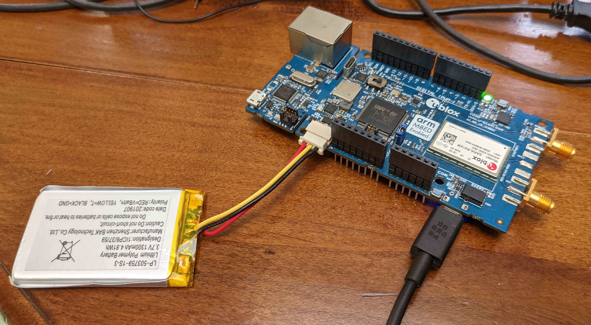
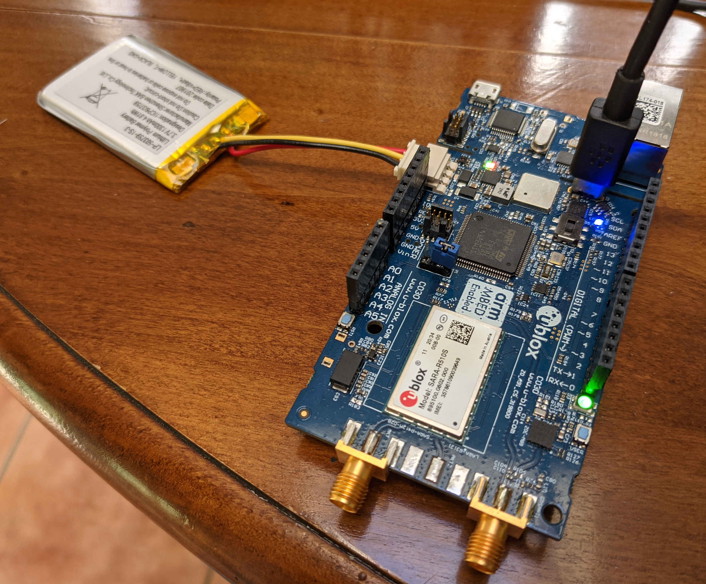

# Introduction
This is not so much an example as a program that is required if you wish to update the FW of a SARA-R4 or SARA-R5 module on a C030 board; a binary is also included to save you having to perform the build.

# Build
You don't need to build this example, a pre-built binary is included, however if you wish to do so:

Use the [port/platform/stm32cube/mcu/stm32f4/runner](/port/platform/stm32cube/mcu/stm32f4/runner) build; the instructions there will tell you how to set/override \#defines.  The following \#defines are relevant (noting that NO quotation marks should be included when setting a \#define to a string):

`U_CFG_APP_FILTER`: set this to `exampleC030ModuleFwUpdate` so that *just* this example will be run.

# Usage
Download the `.bin` file to your C030 board by dragging and dropping it onto the mapped drive that appears when the board is plugged into your PC.

You MUST then either connect a LiPo battery to the board (e.g. [LP-503759-1S-3](https://uk.farnell.com/bak/lp-503759-is-3/battery-lithium-pol-3-7v-1300/dp/2077882)) or supply 3.8V @ 5 Amps to the Vin pin of the Arduino connector of the C030 board and move the jumper P1 to be nearest that pin (furthest from the module); USB power is not sufficient.

The procedure to perform the module FW update is then as follows:

- Disconnect your USB cable from the debug USB connector and instead plug it directly into the module's USB connector:

  - for C030-R4xx this is the USB connector beneath the board closest to the RF connector,

  

  - for C030-R5 this is the vertical USB connector near the Ethernet port; you must ALSO move the switch next to it so that it is closest to the module (don't forget to move it back afterwards or the MCU on the board will be unable to communicate with the module).

  

- Obtain the u-blox module firmware update utility, EasyFlash, copy the `.dof` file for the module firmware you wish to load into the same directory as the EasyFlash executable and start EasyFlash in Administrator mode.

- Select your module type and the correct COM port: in the SARA-R4 case this will appear as a "Qualcomm HS-USB MDM Diagnostics" COM port, in the SARA-R5 case there will be two "Silicon Labs Dual CP2105 USB to UART Bridge" COM ports but it is not easily possible to tell which one is the correct port, unfortunately; you will need to try both.

- Select a speed of 3000000 for C030-SARA-R4xx or 921600 baud for C030-R5 (since the Silicon Labs bridges are only rated at up to 2 Mbits/s).

- When EasyFlash tells you to reset the module, lift and then replace the P1 jumper of the C030 board.

- Wait for the firmware update to complete.

- In the SARA-R5 case, after the firmware update has been performed, make sure to move the switch beside the vertical USB connector back to be furthest away from the module.