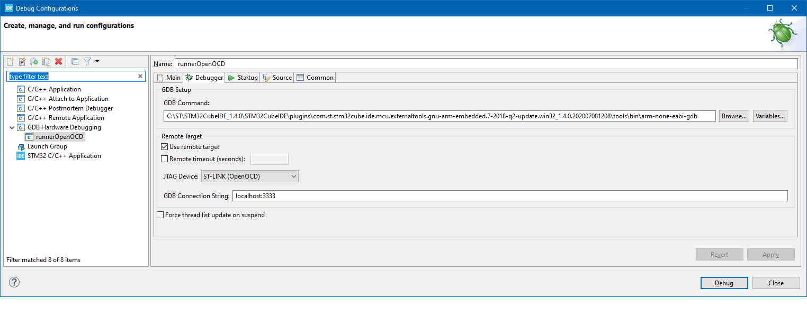

# Introduction
This directory contains the build infrastructure for STM32U5 MCUs using the STM32Cube FW SDK.  The STM32U5 device configuration matches that of the STM32U575ZI device that can be found on the ST NUCLEO-U575ZI-Q board; no attempt is made to optimise the MCU RAM/flash etc. sizes, you need to know how to do that yourself.

# SDK Installation
Clone a version (this code was tested with v1.5.0) of the STM32U5 MCU package (containing their HAL etc.) from here:

https://github.com/STMicroelectronics/STM32CubeU5

You will need to specify the location of this directory when you compile `ubxlib` [runner](runner).

If you wish to use [runner_freertos](runner_freertos) instead, i.e. with FreeRTOS rather than ThreadX, you may instead clone a version (we tested with v1.1.0) of this repo:

https://github.com/STMicroelectronics/x-cube-freertos

...which provides a CMSIS V2 layer on top of FreeRTOS plus the STM32U5 HAL files.  Note that the CMSIS HAL files in the FreeRTOS repo are updated less often than those in the main STM32CubeU5 repo and so you may wish to always pick-up the STM32U5 HAL driver files (i.e. the contents of the `Drivers/STM32U5xx_HAL_Driver` directory) from the first repo; the `Makefile` in [runner_freertos](runner_freertos) accommodates this.

# RTOS
On STM32U5 `ubxlib` makes all RTOS calls through the CMSIS V2 API and so it is possible to use FreeRTOS as well as ThreadX.  For _all_ builds `U_PORT_STM32_PURE_CMSIS` must be defined and ThreadX will be the default RTOS; to switch to FreeRTOS `U_PORT_STM32_CMSIS_ON_FREERTOS` must _also_ be defined.  Note that memory management is quite different between the two RTOSes:

- In the ThreadX case, memory management is provided by ThreadX itself; `ubxlib` has been integrated with the CMSIS 2 layer provided by ST assuming that `USE_DYNAMIC_MEMORY_ALLOCATION` is defined.  All of the non-statically required RAM on the STM32U5 is allocated in the default [linker file](../../app/STM32U575ZITX_FLASH.ld) to a `_threadx_heap` section of size `RTOS2_BYTE_POOL_SIZE`; the stack and heap memory is allocated by ThreadX from there.
- In the FreeRTOS case, memory management is provided through `newlib` `malloc()`/`free()` in the usual way.

The ThreadX tick-rate is set by ST to 10 ms and this same tick rate is used in the FreeRTOS case.

# Tickless Mode
In the porting layer for this platform the `SysTick_Handler()` of the STM32U5 (see the bottom of [u_exception_handler.c](/port/platform/stm32cube/src/u_exception_handler.c)) is assumed to provide a 10 ms RTOS tick which is used as a source of time for `uPortGetTickTimeMs()`.  This means that **if you want to use the STM32U5 in tickless mode** you will need to modify the port either to find another source of tick for `uPortGetTickTimeMs()`, or to put in a call that updates `gTickTimerRtosCount` when FreeRTOS resumes after a tickless period, otherwise time will go wrong and things like wake-up from power-saving mode in a cellular module may not work correctly.

# CMSIS Version
Only CMSIS V2 is supported on STM32U5.

# Trace Output
In order to conserve HW resources the trace output from this platform is sent over SWD using an ITM channel. There are many ways to read out the ITM trace output:

## STM32Cube IDE
If you want to use the STM3Cube IDE you can import our [runner](runner) build as a `Makefile` project and debug it with [OpenOCD](https://github.com/xpack-dev-tools/openocd-xpack), configuring the STM32Cube IDE as below:

...but first copying [stm32cube_ide_openocd_swo.cfg](stm32cube_ide_openocd_swo.cfg) to your OpenOCD `scripts` directory and running the OpenOCD GDB server (from that directory) in a separate command window with a command-line of the following form:

`..\bin\openocd.exe --file stm32cube_ide_openocd_swo.cfg`

However it doesn't seem possible to get the internal STM32Cube IDE SWV viewer to read the trace output when using OpenOCD.

The simplest fix is to run a telnet application which will ignore nulls (since only one of the 4 bytes sent from the ITM trace for each logged character is populated, ignoring nulls is essential) connected on port 40404 (the port which [stm32cube_ide_openocd_swo.cfg](stm32cube_ide_openocd_swo.cfg) directs SWO output to); [TeraTerm](https://tera-term.en.softonic.com/) will do this for you (set `Terminal` `new-line` `receive` to `AUTO` for correct line-endings).

Alternatively you may use the SWV Viewer built into the [STM32Cube Programmer](https://www.st.com/en/development-tools/stm32cubeprog.html).

# stm32u5.mk
This `Makefile` can be used to include ubxlib in your STM32U5 application. Before including `stm32u5.mk` you must set the `UBXLIB_BASE` variable to the root directory of `ubxlib`.
The `Makefile` will then create a number of variables that you can use for retrieving `ubxlib` source files and include directories:
- `UBXLIB_SRC`: a list of all the `.c` files,
- `UBXLIB_INC`: a list of the include directories,
- `UBXLIB_TEST_SRC`: a list of all the test `.c` files,
- `UBXLIB_TEST_INC`: a list of test include directories.

# Maintenance
- When updating this build to a new version of  the STM32CubeU5 FW change the release version stated in the introduction above.
